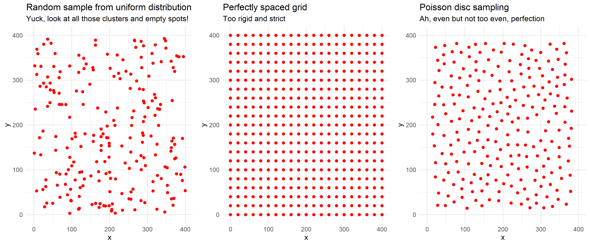

# poissondisc

<!-- badges: start -->

<!-- badges: end -->

poissondisc is a tiny package that implements Robert Bridson’s algorithm
for fast poisson disc sampling. Poisson disc sampling is a method to
produce a set of points that are random, but never closer to each other
than some minimum distance. There are many applications in computer
graphics, generative art, or geospatial analysis where you want a
distribution of points that are roughly evenly spaced, but still
pseudo-random. This is best illustrated by a graphic:

Three ways to generate a set of (x, y) points:

  - Method 1: sample x and y positions from a uniform distribution.
    These points will be random, but they end up forming lots of
    clusters and empty parts.
  - Method 2: calculate x and y positions to be a perfect grid with
    exactly some distance between each point. These will be perfectly
    spaced, but it has no randomness.
  - Method 3: Poisson disc sampling. These points will be roughly evenly
    spaced, but jittered in a natural looking way



## Installation

Currently this package only lives on github. You can install it like
this:

``` r
# install.packages("devtools")
devtools::install_github("will-r-chase/poissondisc")
```

## Example

This package contains only one function `poisson_disc()`. The function
returns a dataframe with the x and y coordinates of the poisson disc
sampled points. You must specify the height and width within which you
want to generate your points (ie. your canvas size) and the minimum
distance between points. Optionally, you can specify the number of
samples before rejection, but it is recommended that you leave it at 30
unless you know what you’re doing (read
<a href="https://www.cs.ubc.ca/~rbridson/docs/bridson-siggraph07-poissondisk.pdf" target="_blank">Bridson’s
paper</a> if you want to understand this parameter
better).

``` r
#generate a set of points within a 400x400 canvas with a minimum distance of 20
pts <- poisson_disc(400, 400, 20)

#plot the points
library(ggplot)
ggplot(pts, aes(x, y)) + geom_point()
```

## Future plans or improvements to this package

I only plan to use this for generative art, but there are some real uses
for poisson disc sampling. For my purposes, this simple implementation
works fine, but it could be improved in several ways if you wanted to
contribute. First, this algorithm is generalizable to any number of
dimensions, but I’ve only implemented it in 2 dimensions. Second, this
implementation is fast enough for my purposes, but if you wanted to
speed it up you could re-write it in Rcpp, as it uses lots of for loops,
it would be much faster that way. Third, I think the best use-case for
this is geospatial analysis, but that might benefit from a different
implementation. Mitchell’s best-candidate algorithm can be used to
generate poisson disc distribution on a sphere, which might be useful
for geospatial. If you want to contribute or you find a bug, please open
an issue or submit a pull request. If you like this package, tell me
about it on Twitter
<a href="https://twitter.com/W_R_Chase" target="_blank">@W\_R\_Chase</a>.

My to-do list:

  - Write more tests :)
  - Implement helper-function to restrict points inside polygon w/
    `mgcv::inSide()`
  - Add travis/appveyor CI
